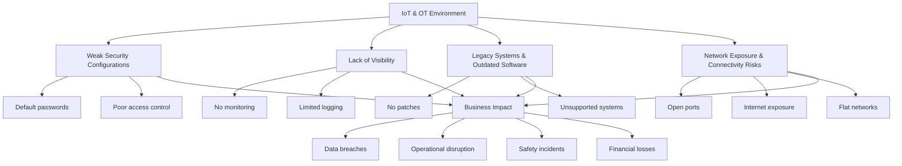

# Common Risks in IoT and OT Environments

## Overview

IoT (Internet of Things) and OT (Operational Technology) environments introduce unique security challenges due to:

- Massive scale of connected devices
- Direct interaction with physical systems
- Limited security capabilities of devices

They are often targeted because they bridge IT systems and real-world operations.

---

## Common Risks

### Weak Authentication
- Devices often use default or weak credentials.

Many IoT devices use:
- default credentials (e.g., admin/admin)
- hardcoded passwords
- no authentication at all

Real-world example: Botnets like Mirai botnet exploited default credentials to take over thousands of devices.

Risk:
- Unauthorized access
- Device takeover
- Use in DDoS attacks

---

### Lack of Updates
- Many devices are not regularly patched or updated.

IoT/OT devices are often:
- rarely updated
- unsupported by vendors
- difficult to patch (especially OT systems)

Why?
- uptime requirements (OT cannot be easily stopped)
- lack of update mechanisms

Risk
- Exploitable known vulnerabilities
- Long-term exposure

---

### Insecure Communication
- Data may be transmitted without encryption.

Devices may communicate using:
- unencrypted protocols (HTTP, Telnet)
- weak encryption

Risk
- Data interception (MITM attacks)
- Credential theft
- Command manipulation

---

### Large Attack Surface
- Numerous connected devices increase exposure.

IoT environments include:
- hundreds or thousands of devices
- distributed systems (cloud + edge + local)

Risk
- More entry points for attackers
- Harder monitoring and management
- Increased chance of misconfiguration

---

### Legacy Systems (OT)
- Older systems may lack modern security features.

OT systems often rely on:
- outdated hardware/software
- proprietary protocols
- no built-in security

Why?
- long lifecycle (10–30 years)
- high cost of replacement

Risk
- No encryption
- No authentication
- High vulnerability to modern attacks

---

## Impact of Risks

Digital Impact
- Data breaches
- Loss of sensitive information
- Unauthorized access

Operational Impact
- System downtime
- Production disruption
- Financial loss

Physical Impact (VERY IMPORTANT in OT)
- Equipment damage
- Infrastructure failure
- Environmental damage

Safety Impact
- Risk to human life
- Industrial accidents

Example: Stuxnet attack showed how cyber attacks can cause physical destruction.

---

## Mitigation Strategies

1. Strong Authentication
- Change default credentials
- Use MFA where possible
- Implement device identity management 

2. Network Segmentation
- Seperate:IT network, IoT devices, OT systems
- Example: VLANs, Zero Trust architecture

3. Encryption
- Use TLS instead of HTTP
- Secure device-to-cloud communication
- Encrypt sensitive data

4. Continuous Monitoring
- Intrusion detection systems (IDS)
- Logging and anomaly detection
- Behavioral monitoring

5. Patch & Lifecycle Management
- Regular firmware updates
- Asset inventory
- Replace unsupported devices

6. Defense in Depth 
- Combine: network security, device security, identity controls

---

## Key Takeaways

- IoT and OT systems introduce unique challenges  
- Risks affect both digital and physical environments  
- Security must be proactive and continuous  

Managing risk in IoT and OT requires a combination of technical controls and strategic planning.
