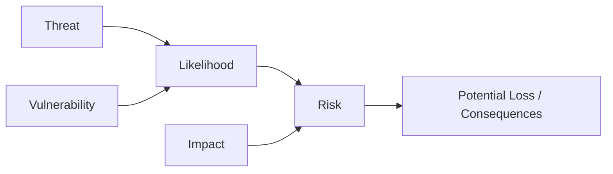

# Risk Management

## Overview

Risk management in cybersecurity is the process of identifying, analyzing, and mitigating risks that could impact systems, data, or operations.

It provides a structured approach to understanding how threats exploit vulnerabilities and what consequences this may have for an organization.

Effective risk management helps organizations make informed decisions about security investments, prioritize resources, and balance protection with business needs.

---

## Risk Components

Risk is typically defined by three core elements:

- **Threat** – a potential cause of harm (e.g. malware, insider threats, attackers)
- **Vulnerability** – a weakness that can be exploited (e.g. misconfiguration, outdated software)
- **Impact** – the potential damage if the threat is realized (e.g. financial loss, data breach, downtime)

These elements are often combined conceptually as:

Where likelihood depends on the presence of threats and vulnerabilities.

---

## Risk Management Process

A typical risk management process includes the following steps:

1. **Identify assets and risks**  
   Determine what needs to be protected (systems, data, infrastructure) and what risks exist.

2. **Assess vulnerabilities and threats**  
   Identify weaknesses and potential attack vectors that could be exploited.

3. **Evaluate likelihood and impact**  
   Estimate how likely a risk is and what consequences it may have.

4. **Implement controls**  
   Apply technical, organizational, or procedural measures to reduce risk.

5. **Monitor and review**  
   Continuously track risks and update controls as the threat landscape evolves.

---

## Risk Assessment

Risk assessment is the process of evaluating and prioritizing risks based on their severity.

It typically considers:

- **Likelihood** - how probable the event is
- **Impact** - how severe the consequences are

### Types of Risk Assessment

- **Qualitative**  
  Uses categories such as low, medium, high  
  → simple and fast, but less precise

- **Quantitative**  
  Uses numerical values (e.g. financial loss estimates)  
  → more precise, but requires more data

---

## Risk Mitigation Strategies

---

## Key Takeaways

- Risk management supports informed and strategic decision-making  
- Not all risks can be eliminated - some must be managed or accepted  
- Prioritization is critical due to limited resources  
- Both technical and human factors influence risk  

---

## Notes

Effective risk management requires balancing **security, cost, and usability**.

Overly strict controls may reduce usability, while weak controls increase exposure to threats.

Continuous monitoring and adaptation are essential, as risks evolve over time.
