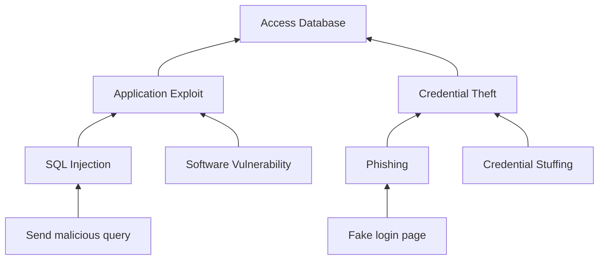
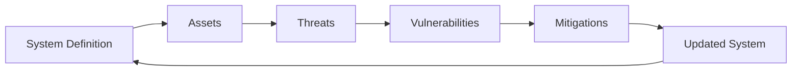

# Threat Modeling

## Overview

Threat modeling is a structured approach to identifying, analyzing, and addressing potential threats in a system.

It focuses on understanding how a system can be attacked and what weaknesses may be exploited. By identifying threats early, organizations can design more secure systems and reduce potential risks before deployment.

Threat modeling is a proactive security practice, commonly used in secure software development and system architecture.

---

## Purpose

- Identify potential threats early in the design phase  
- Understand how attackers might exploit a system  
- Improve system architecture and security design  
- Support risk-based decision-making  

---

## Key Elements

Threat modeling typically involves the following components:

- **Assets** – what needs to be protected (e.g. data, systems, services)  
- **Threats** – what can go wrong (e.g. attacker actions, misuse scenarios)  
- **Vulnerabilities** – weaknesses that can be exploited  
- **Attack vectors** – the paths or methods used to carry out an attack  

---

## Common Models

### STRIDE

STRIDE is a widely used threat modeling framework:

- **Spoofing** – impersonating another user or system  
- **Tampering** – modifying data or code  
- **Repudiation** – denying actions without accountability  
- **Information Disclosure** – exposing sensitive data  
- **Denial of Service (DoS)** – disrupting system availability  
- **Elevation of Privilege** – gaining unauthorized access  

---

### Attack Trees

Attack trees model how an attacker can achieve a goal by breaking it down into smaller steps.

- Root = attacker goal (e.g. “access database”)  
- Branches = different attack paths  
- Leaves = specific actions  

---

## Threat Modeling Process

1. **Define the system**  
   Understand system architecture, components, and data flows  

2. **Identify assets**  
   Determine what is valuable and needs protection  

3. **Identify threats**  
   Analyze what could go wrong using models like STRIDE  

4. **Analyze vulnerabilities**  
   Identify weaknesses in the system design or implementation  

5. **Define mitigations**  
   Apply controls to reduce or eliminate identified risks  

---

## Benefits

- Improves security awareness during system design  
- Helps identify vulnerabilities before implementation  
- Reduces the likelihood of design flaws  
- Supports prioritization of security efforts  
- Enables more secure and resilient architectures  

---

## Key Takeaways

- Threat modeling is a **proactive** approach to security  
- It focuses on understanding attacker behavior and system weaknesses  
- It is most effective when applied early in the design phase  
- It complements risk management and secure development practices  

---

## Notes

Threat modeling is widely used in secure software development, DevSecOps, and system architecture.

Regular updates are necessary, as systems evolve and new threats emerge.
