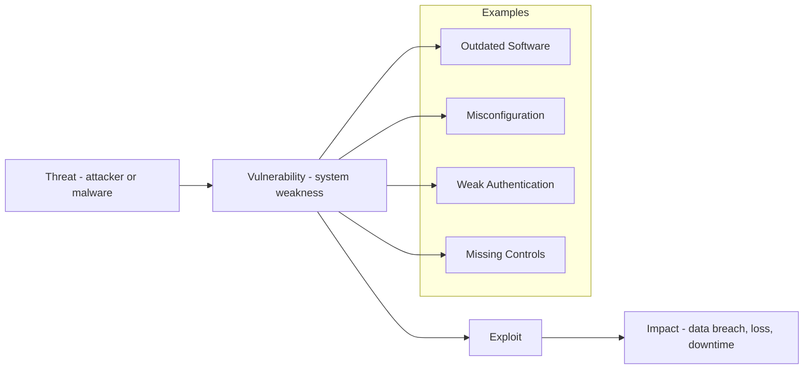
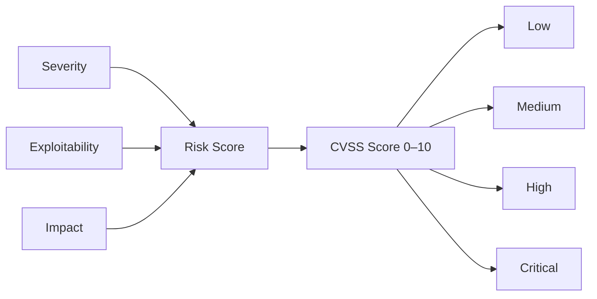
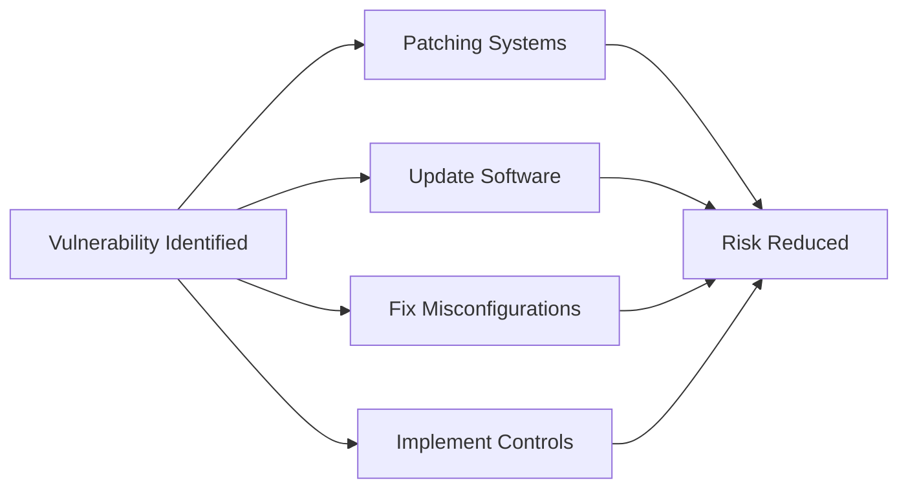

# Vulnerability Assessment

## Overview

Vulnerability assessment is the process of identifying, evaluating, and prioritizing security weaknesses in a system.

It helps organizations understand where their systems are exposed and what risks need to be addressed. As part of a broader security strategy, vulnerability assessment supports continuous improvement of security posture.

---

## What is a Vulnerability?

A vulnerability is a flaw or weakness in a system that can be exploited by a threat.

Examples include:

- Outdated software with known exploits  
- Misconfigured systems or services  
- Weak authentication mechanisms  
- Missing security controls  

### Vulnerability Concept Diagram

---

## Assessment Methods

Vulnerability assessments can be performed using different approaches:

- **Automated scanning tools**  
  Use tools (e.g. vulnerability scanners) to detect known issues quickly  

- **Manual testing**  
  Security experts analyze systems to identify complex or hidden vulnerabilities  

- **Configuration reviews**  
  Evaluate system and network configurations against security best practices  

Each method has strengths — combining them provides better coverage.

---

## Risk Evaluation

Identified vulnerabilities are typically assessed based on:

- **Severity** – how critical the vulnerability is  
- **Exploitability** – how easy it is to exploit  
- **Impact** – the potential damage if exploited  

In practice, organizations often use scoring systems such as:

- **CVSS (Common Vulnerability Scoring System)**  
  → provides standardized severity scores (e.g. 0–10)

### Vulnerability Scoring (CVSS Concept)

CVSS provides a standardized way to prioritize vulnerabilities based on their severity and potential impact.

---

## Remediation

Once vulnerabilities are identified, they should be addressed through:

- **Patching systems**  
  Applying security updates and fixes  

- **Updating software**  
  Removing outdated or unsupported components  

- **Fixing misconfigurations**  
  Correcting insecure settings  

- **Implementing controls**  
  Adding safeguards such as access control or monitoring  

### Vulnerability Remediation Process

---

## Continuous Process

Vulnerability assessment is not a one-time activity.

It should be performed regularly because:

- New vulnerabilities are discovered constantly  
- Systems and environments change over time  
- Attack techniques evolve  

Continuous monitoring helps maintain a strong security posture.

---

## Benefits

- Improves visibility of security weaknesses  
- Reduces risk of successful attacks  
- Supports prioritization of remediation efforts  
- Strengthens overall system security  

---

## Key Takeaways

- Vulnerabilities are common and must be actively managed  
- Regular assessment is essential for maintaining security  
- Prioritization is critical due to limited resources  
- Combining automated and manual methods provides better results  

---

## Notes

Vulnerability assessment is often combined with penetration testing for deeper analysis.

While vulnerability assessment identifies weaknesses, penetration testing simulates real attacks to evaluate their impact.

